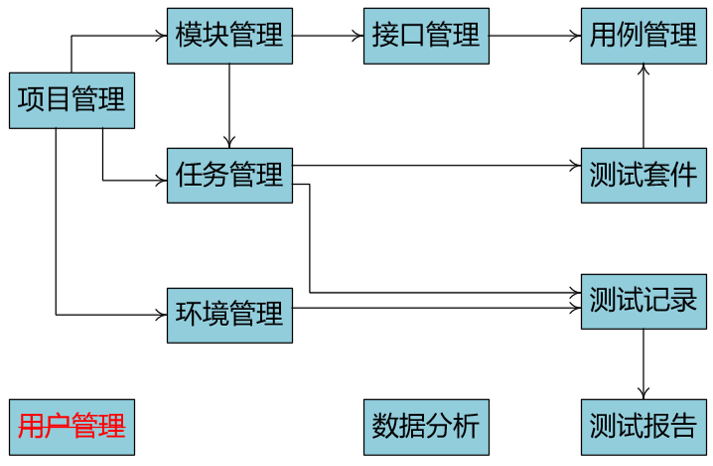
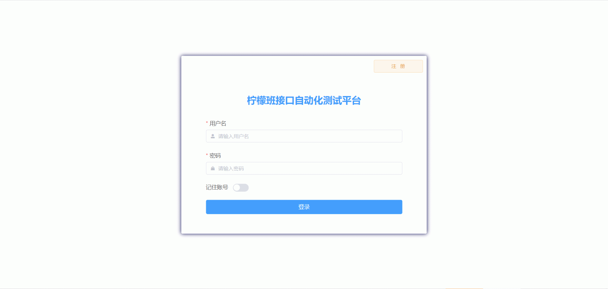
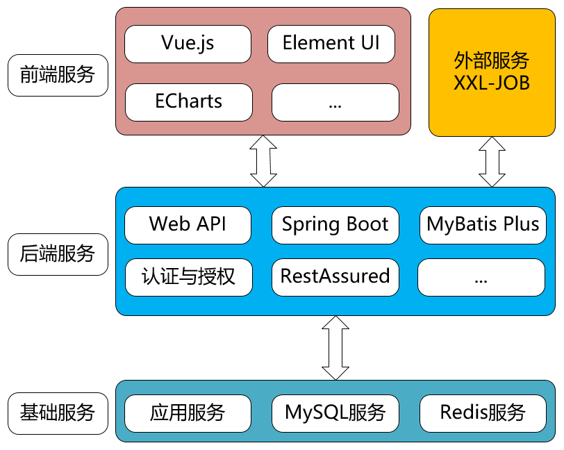
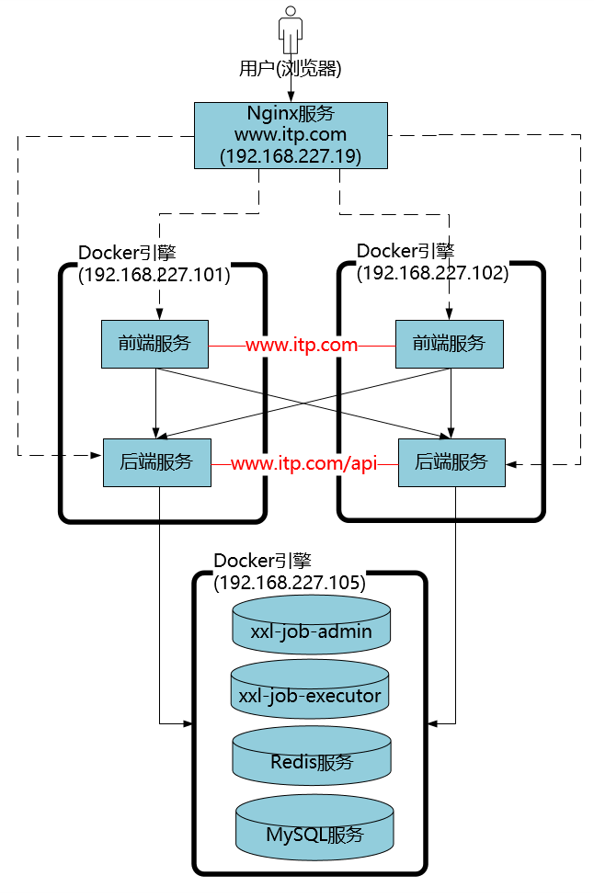
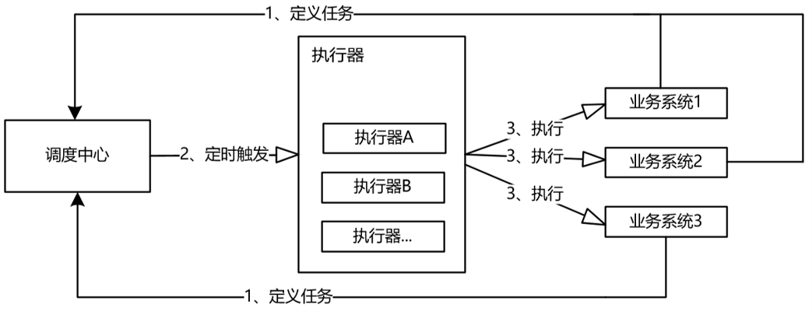

<h1>柠檬班接口自动化测试平台</h1>

《柠檬班接口自动化测试平台》是一个针对REST接口进行自动化测试的平台，在该平台上，能实现一站式的接口自动化测试工作。

# 主要功能

- 平台延续企业接口测试的“传统语言”，包括术语、流程、接口原则、安全规则、用例设计等规范
- 提供了用户管理、项目管理、接口设计、用例设计、任务管理、任务运行(手动/定时)、测试报告等功能
- 具体的业务功能图如下：

# 功能演示

**在线体验地址**：http://106.55.27.135:9905/，注册后，选择《前程贷》项目体验。

# 项目结构

- 一共包含4个项目和1个脚本目录
  - **interface-test-platform-front**：前端项目，负责与用户交互；使用vue.js 3.x，Vue.js 2.x版本可查看interface-test-plateform-front-vue2
  - **interface-test-platform-backend**：后端项目，主要的业务逻辑
  - **xxl-job-admin**：xxl-job任务中心项目，可直接使用xxl-job官方的项目包，运行后使用默认用户名和密码admin/123456
  - **xxl-job-executor-springboot**：xxl-job执行器项目，使用xxl-job官方的项目包，添加了一个支持HTTP get方式回调的执行器 httpGetJobHandler 
  - scripts：脚本目录，包括一个xxl-job任务中心项目的数据库脚本tables_xxl_job.sql，和一个平台的数据库脚本itp.sql

# 技术栈

- 前端：Vue.js
- 后端：Spring Boot
- 数据库：MySQL
- 定时任务框架：XXL-JOB

具体技术结构图如下

# 部署

- 一共要部署6个项目或第三方插件

  - **Redis**，缓存服务，提供多负载下的会话缓存；用例依赖时前置用例的提取值
  - **MySQL**，数据持久化服务
    - 创建itp数据库，执行itp.sql脚本，并包含基础的示例数据
    - 执行tables_xxl_job.sql，会自动创建xxl-job需要的数据库
  - **xxl-job-admin**，xxl-job任务调度中心，按照Spring Boot项目规则部署，可参考官网
  - **xxl-job-executor-springboot**，xxl-job执行器，按照Spring Boot项目规则部署，可参考官网
  - **interface-test-platform-backend**，后端项目，按照Spring Boot项目规则部署到服务器或Docker容器
  - **interface-test-platform-front**，前端项目，按照前端项目静态特性部署到Nginx或Docker容器

- 本地运行

  - **Redis**，缓存服务
    - 去官网下载并安装服务，本机或Linux主机都可以，用于后端项目
    - 一般默认端口为6379
  - **MySQL**，数据持久化服务
    - 去官网下载并安装服务，建议使用5.7，本机和Linux主机都可以，用于xxl-job任务调度中心、后端项目
    - 一般默认端口为3306
  - **xxl-job-admin**，xxl-job任务调度中心，可使用官方的源代码
    - 使用IntelliJ IDEA打开
    - 修改application.properties中的数据库连接指向MySQL服务
    - 启动后，默认端口为8080，使用http://localhost:8080/xxl-job-admin访问，账号为admin/123456
  - **xxl-job-executor-springboot**，xxl-job执行器，基于官方的源代码
    - 使用IntelliJ IDEA打开，
    - 修改application.properties中xxl-job任务调度中心地址(xxl.job.admin.addresses)指向xxl-job-admin
    - 启动后，默认端口8081，并监听9999端口用于供xxl-job任务调度中心调用指定执行器
    - 注意，在官方的源代码中，添加了httpGetJobHandler的自定义执行，用于回调后端服务的GET方式的业务回调API
  - **interface-test-platform-backend**，后端服务
    - 使用IntelliJ IDEA打开
    - 需要修改application.properties中4个配置
      - 数据库连接指向MySQL服务
      - Redis连接指向Redis服务
      - 定时任务服务指向xxl-job任务调度中心
      - 回调业务地址前缀，配置当前服务的地址url主机、端口
    - 启动后，默认端口为8088，使用http://localhost:8088/swagger-ui/index.html查看后端Swagger格式的api
  - **interface-test-platform-front**，前端服务
    - 使用Visual Studio Code打开项目
    - 修改vue.config.js中devServer.proxy.target指向后端项目地址（http://localhost:8088)
    - 在终端面板中，使用npm run serve运行，会动态分配端口（如8082，注意看启动界面提示）
    - 启动后，使用http://localhost:8082访问服务
    - 账号为
      - 管理员：admin/123456
      - 普通员工：staff/123456

- 典型部署

  - 业务典型部署图
  
    
    
  - XXL-JOB部署
  
    - XXL-JOB可服务于多个项目，一般会单独部署，可参考官网，也可以参照业务典型部署图
    
    - 其与业务的交互逻辑如下
    
      
  
  

# 其他

- 项目及相关测试技术学习，请关注柠檬班公众号

  

# 感谢

- <a href="https://www.xuxueli.com/xxl-job/" target="_blank">XXL-JOB</a>：提供简单、易用的分布式任务调度平台
- <a href="https://element.eleme.cn/" target="_blank">Element Plus</a>：提供丰富的基于Vue.js的前端UI组件库

